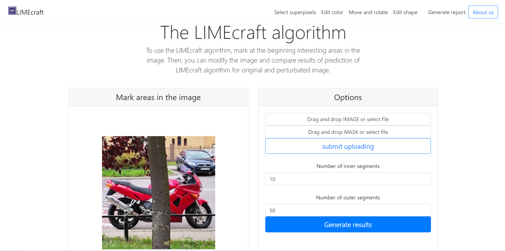

# LIMEcraft
LIMEcraft: Handcrafted superpixel selectionand inspection for Visual eXplanations


The LIMEcraft algorithm is an explanatory method based on image perturbations. Its prototype was the LIME algorithm - but not without significant drawbacks, especially in the context of difficult cases and medical imaging. The superiority of the LIMEcraft algorithm is primarily the ability to freely select the areas that we want to analyze, as well as the aforementioned perturbations, thanks to which we can compare with the original image, and thus better understand which features have a significant impact on the prediction of the model.

## About the User Interface

The interface is displayed in the browser, where the user can upload the image and the superpixel mask from their own computer. They can also manually mark interesting areas in the image with the help of a computer mouse. Then, they choose the number of superpixels the areas selected by them are divided into. The same procedure is also applied to the areas uploaded in the mask and, independently, to the areas outside. Then, they just need to confirm their actions and wait for the result of the LIMEcraft algorithm. The user receives the model prediction results expressed as the percentage for both the class originally predicted and the class after image editing.

 <p align="center">
  
</p>

### Functionalities:
- [x] upload image
- [x] upload mask
- [x] manually select mask
- [x] change number of superpixels inside and outside the mask
- [x] show how the prediction changed
- [x] change color - RGB
- [x] change shape - power expansion
- [x] rotate - degrees
- [x] shift - left/right and down/up
- [x] remove object by shifting it
- [x] generate report

## How to run the code

git clone https://github.com/MI2DataLab/LIMEcraft.git \
cd LIMEcraft\
\
virtualenv venv\
source venv/bin/activate\
python -m ipykernel install --user --name=venv\
\
pip install -r requirements.txt\
In case of problems with library versions, try to install the latest ones \
git submodule update --init\
\
type *jupyter notebook* in the console\
go to code/dashboard_LIMEcraft.ipynb\
choose venv in Kernel -> Change kernel
run the whole notebook\
type http://127.0.0.1:8001/ in the web browser
\
If you have problems with running code on GPU, put *os.environ['CUDA_VISIBLE_DEVICES'] = '-1'* after *import os* in code/dashboard_LIMEcraft.ipynb.

### How to test own model?

go to web browser and download *full_skin_cancer_model.h5* from https://www.kaggle.com/kmader/deep-learning-skin-lesion-classification/data \
put the model in the folder *code*\
change selected model in *code/dashboard_LIMEcraft.ipynb* in section "Choose model"

## Reference

Paper for this work is avaliable at:
<https://arxiv.org/abs/2111.08094>

If you find our work useful, please cite our paper:

```
@misc{Hryniewska2021LIMEcraft,
	title={{LIMEcraft: Handcrafted superpixel selection and inspection for Visual eXplanations}}, 
	author={Weronika Hryniewska and Adrianna Grudzień and Przemysław Biecek},
	year={2021},
	eprint={2111.08094},
	archivePrefix={arXiv},
	primaryClass={cs.CV}
	keywords = {Explainable AI, superpixels, LIME, image features, interactive User Interface},
	howpublished = {\url{https://arxiv.org/abs/2111.08094}},
}
```
